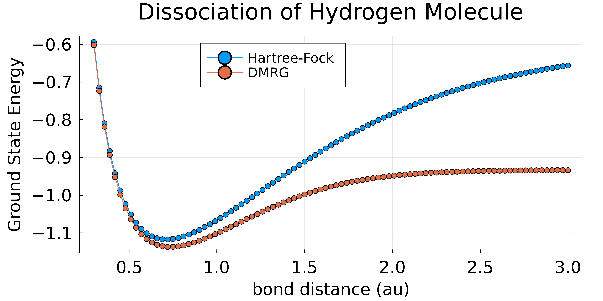

# ITensorChemistry.jl

[](https://mtfishman.github.io/ITensorChemistry.jl/stable)
[](https://mtfishman.github.io/ITensorChemistry.jl/dev)
[](https://github.com/mtfishman/ITensorChemistry.jl/actions/workflows/CI.yml?query=branch%3Amain)
[](https://codecov.io/gh/mtfishman/ITensorChemistry.jl)
[](https://github.com/invenia/BlueStyle)

## Overview

The main functionality of this package is outputting a second quantized quantum chemistry Hamiltonian in the molecular orbital basis, given a molecule and atomic orbital basis.

Below the hood, the package uses Hartree-Fock implemented in [Fermi.jl](https://github.com/FermiQC/Fermi.jl) to obtain the molecular orbital basis and one-electron and two-electron integrals.

The main output is an `OpSum` from ITensors.jl, which is a representation of the second quantized Hamiltonian. This can be converted into a variety of other formats, such as a matrix product operator (MPO) to run DMRG, quantum circuit, full matrix representation for exact diagonalization (ED) for full configuration interaction (FCI) calculations, etc.

## Installation

```julia
julia> using Pkg

julia> Pkg.add(; url="https://github.com/mtfishman/ITensorChemistry.jl")
```

## Examples

### Dissociation energies


```julia
using ITensors
using ITensorChemistry
using Plots

# bond distances
r⃗ = 0.3:0.03:3.0

# hilbert space
s = siteinds("Electron", 2; conserve_qns=true)

# dmrg params
sweeps = Sweeps(10)
setmaxdim!(sweeps, 10,20,30,40,50,100)
setcutoff!(sweeps, 1e-8)
setnoise!(sweeps, 1e-6, 1e-7, 1e-8, 0.0)

for r in r⃗
  # define molecule geometry
  molecule = Molecule([("H", 0.0, 0.0, 0.0), 
                       ("H",   r, 0.0, 0.0)])
                  
  # build electronic hamiltonian and solve HF
  (; hamiltonian, hartree_fock_state, hartree_fock_energy) = 
       molecular_orbital_hamiltonian(; molecule, 
                                       basis = "sto-3g, 
                                       diis = false, 
                                       oda = false)
  
  # build Hamiltonian MPO
  H = MPO(hamiltonian, s)
  
  # initialize MPS to HF state
  ψhf = MPS(s, hartree_fock_state)
  
  # run dmrg
  dmrg_energy, _ = dmrg(H, ψhf, sweeps; outputlevel = 0)
end
```



### Jordan-Wigner transformation

```julia
using ITensors
using ITensorChemistry

# Nitrogen molecule
molecule = Molecule("N₂")
basis = "sto-3g"
@show molecule

(; hamiltonian, hartree_fock_state, hartree_fock_energy) =
  molecular_orbital_hamiltonian(; molecule, basis)
println("Number of orbitals = ", length(hartree_fock_state))
println("Number of fermionic operators = ", length(hamiltonian))
println("Hartree-Fock state |HF⟩ = |",prod(string.(hartree_fock_state)),"⟩")

qubit_hamiltonian = jordanwigner(hamiltonian)
qubit_state = jordanwigner(hartree_fock_state)
println("Number of qubit operators = ", length(qubit_hamiltonian))
println("Hartree-Fock state |HF⟩ = |",prod(string.(qubit_state)),"⟩") 
# -------------------------------------------------------------------------- 
#  molecule = Molecule
#   Atom 1: N,   r⃗ = (0.0, 0.0, 0.550296)
#   Atom 2: N,   r⃗ = (0.0, 0.0, -0.550296)
#  Number of orbitals = 10
#  Number of fermionic operators = 14181
#  |HF⟩ = |4444444111⟩
#  Number of qubit operators = 17005
#  |HF⟩ = |22222222222222111111⟩
```
